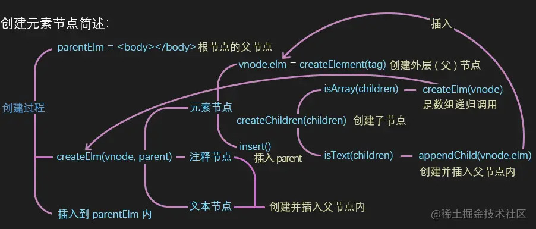
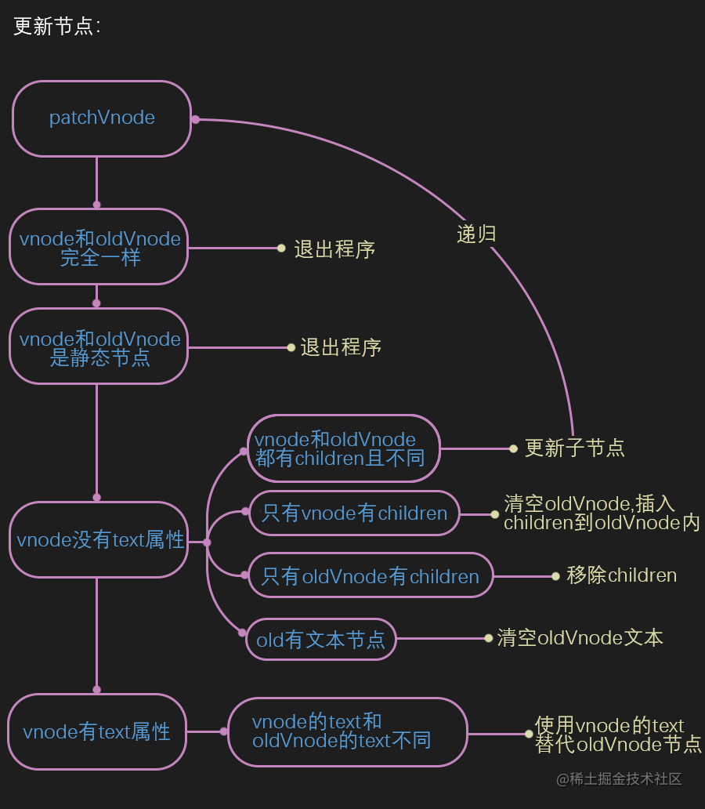

# Vue 为什么要引入虚拟 DOM

Vue1.0 的时候采用细粒度的变化侦测机制来更新试图，当状态变更后，它就在一定程度上知道哪些节点使用了这个状态，从而对这些节点进行更新操作，根本不需要 React 的虚拟 dom 对比及 Angluar 的脏检测流程。

但是这样做其实也是有一定代价的。因为粒度太细，每一个绑定都会有一个对应的 watcher 来观察状态的变化，这样就会有一些内存开销及一些依赖追踪的开销。当状态被越多的节点使用时，开销越大。对于一个大型项目来说，这个开销是非常大的。

因此，Vue.js 2.0 开始就选择了一个中等粒度的解决方案，那就是引入了虚拟 DOM。组件级别是一个 watcher 实例，就是说即使一个组件内有 10 个节点使用了某种状态，但其实也只有一个 watcher （渲染 watcher）在观察这个状态的变化。所以当这个状态发生变化时，只能通知到组件，然后组件内部通过虚拟 DOM 去进行比对渲染。这是一个比较折中的方案。

## 虚拟 DOM 做的事情

- 提供与真实 DOM 节点所对应的虚拟节点 VNode
- 将虚拟节点 Vnode 和旧的虚拟节点 old Vnode 进行对比，然后更新视图（path）
  - 首次渲染（oldVnode 不存在，只有新的）
    - 直接使用新的 Vnode 创建真实节点
    - 把新的 Vnode 给到 oldVnode，下次就可以更新对比了
    - 将使用 Vnode 创建的真实节点插入到视图中旧节点的旁边
    - 将视图中的旧节点删除
  - 更新渲染

path 做的事情

- 创建新增的节点
  - 元素、注释、文本节点，插入到指定的父节点中

- 删除废弃的节点

  - removeVnodes

- 修改需要更新的节点
  - 更新子节点
    - 新增子节点、更新子节点、移动子节点、删除子节点

