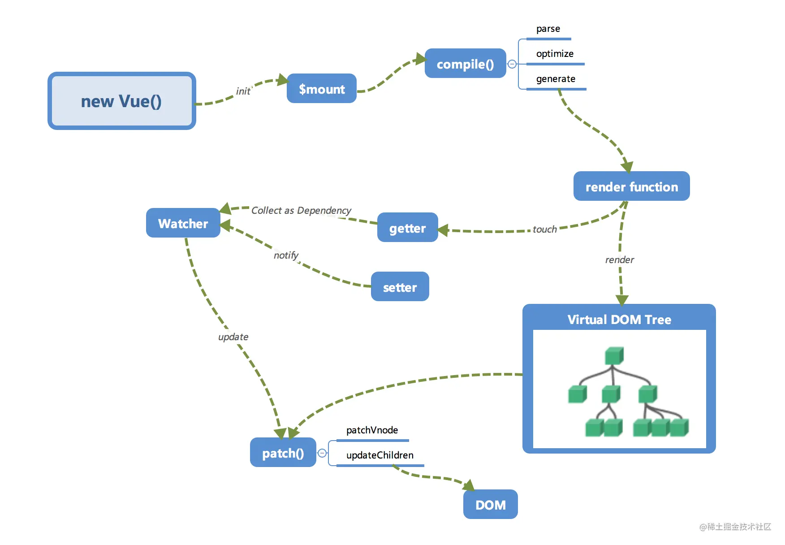

# 总结 & 常见问题解答

## 总结

在本系列的第一节中，笔者对 Vue.js 内部运行机制做了一个全局的概览，当时通过下面这张图把 Vue.js 拆分成一个一个小模块来介绍，之后通过这一系列小节的学习，相信大家已经对 Vue.js 内部的原理有了一个更进一步的了解，对这张图也再也不会感觉到那么陌生。



## 常见问题

1.  怎么实现 `this._test` 改变而不是 `this._data.test` 改变触发更新？

答：其实这中间有一个**代理**的过程。

```js
_proxy(options.data);

function _proxy(data) {
  const that = this;
  Object.keys(data).forEach((key) => {
    Object.defineProperty(that, key, {
      configurable: true,
      enumerable: true,
      get: function proxyGetter() {
        return that._data[key];
      },
      set: function proxySetter(val) {
        that._data[key] = val;
      },
    });
  });
}
```

本质就是通过 `Object.defineProperty` 使在访问 `this` 上的某属性时从 `this._data` 中读取（写入）。

2.  能不能将依赖收集中讲到的 `dep.addSub(Dep.target)` 改成 `dep.addSub(new Watcher())`呢？

为了便于读者理解这部分内容，我将代码做了简化，实际上一个 `Watcher` 对象可能会在多个 `Dep` 中，并不是每次 `addSub` 都是一个新的 `Watcher` 对象，需依赖 `Dep.target` 进行收集（实际上 `Dep.target` 也是通过 `Watcher` 对象的 `get` 方法调用 `pushTarget` 将自身赋值给 `Dep.target`）。

3. 计算属性工作原理

computed 本身是通过代理的方式代理到组件实例上的，所以读取计算属性的时候，执行的是一个内部的 getter，而不是用户定义的方法。

computed 内部实现了一个 lazy（惰性）的 watcher，在实例化 watcher 的时候不会去求值，而是通过 dirty 属性标记计算属性是否需要重新求值， 默认为 true，在 getter 的时候执行专用方法 evaluate 求值，求值完 dirty 设为 false，同时会将计算属性的 watcher 分发给依赖项。当 computed 依赖的任一状态（不一定是 return 中的）发生变化，都会通知这个惰性 watcher，让它把 dirty 属性设置为 true。所以，当再次读取这个计算属性的时候，就会重新去求值。

细分可分为四个阶段：

1. 初始化：为 computed 属性创建 lazy watcher（此处 watcher 指双向绑定中的监听器，下同）。

2. 首次模板渲染：渲染 watcher 检测到 computed 属性时，会调用 computed 属性的 getter 方法，而 computed 属性的 getter 方法会调用依赖属性的 getter，从而形成链式调用，同时保存引用关系用于更新。取得计算结果后 lazy watcher 会将结果缓存，并返回给渲染 watcher 进行模板渲染。

3. 多次模板渲染：直接取 lazy watcher 中的缓存值给到渲染 watcher 进行渲染。

4. 依赖属性更新：根据首次模板渲染阶段构建的依赖关系向上通知 lazy watcher 进行重新计算，缓存计算结果并通知渲染 watcher 重新渲染更新页面。
